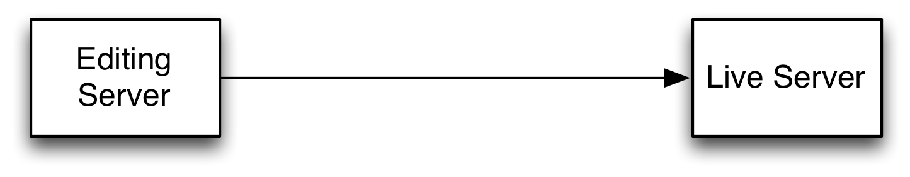
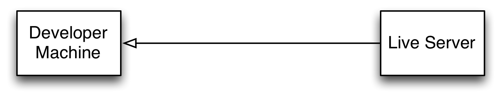
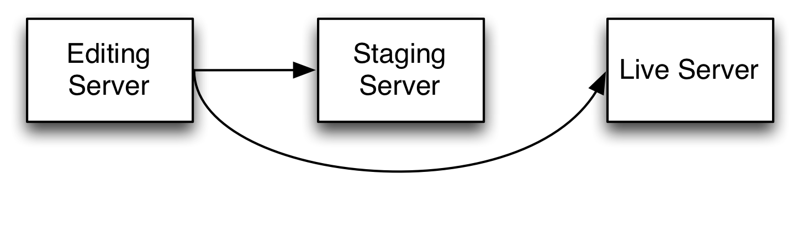
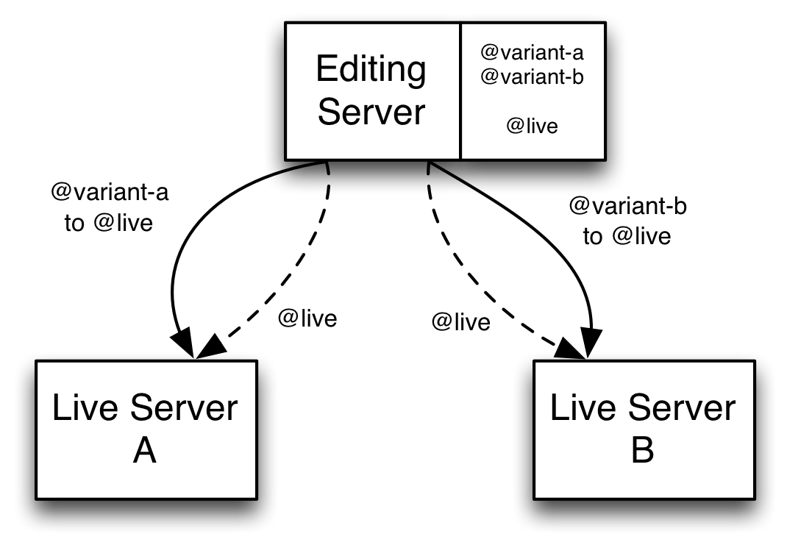

Neos Replicator |version|
=========================

This documentation covering version |release| has been rendered at: |today|

The Neos Replicator allows to replicate content from one site to another, to provide staging and synchronisation.

.. note:: This documentation serves as a specification for the package to be built. None of this is
          currently implemented!

Overview
--------

Use-cases
~~~~~~~~~

The simplest use-case for this is a simple replication from one server to another. This can be used to
have an editing server that is not reachable from the internet. Content is then pushed to a live
server (having no editors):

As simple but working in the other direction: developers can pull live content to their machine, so they
can work with content beyond *lorem ipsum*:

Only a bit more advanced: add a staging machine to the first example and use it to have your legal department
or management double check things before pushing to the live server:

One way to do A/B testing could be to replicate different content to two live servers. After drawing conclusions
from the test, replicate the "winning" version to both live servers. This could be done by using three workspaces,
two for the variants and a final workspace. The variant workspaces are replicated to the live workspace on one of
the servers each. After the winning variant has been published to live on the editing server, that is is pushed to
both servers, again into the live workspace, overriding the previous content.

Installation
------------

The systems need to be set up so far, that Neos can render a "no homepage has been defined". That means a site
package must exist and the configuration and setup of the database must be done.

The package then needs to be available in all Neos instances that will be involved with the replication. It can
be installed by

.. code-block:: none

  $ composer require flownative/neos-replicator

Configuration
-------------

The configuration is split in two areas of responsibility. There is the setup of available nodes to
be used in replication and there is the configuration of the replication itself.

Endpoint configuration
~~~~~~~~~~~~~~~~~~~~~~

This is done in *Settings.yaml* as follows:

.. literalinclude:: ../Configuration/Settings.yaml.example
   :language: yaml
   :lines: 1-18
   :emphasize-lines: 7-

You can have as many nodes as you need, and you can define them all at every system or put only the
needed ones on every setup, depending on the replication you actually need to run.

Replication configuration
~~~~~~~~~~~~~~~~~~~~~~~~~

Replications define what is replicated between systems:

- which data (content, users, assets, …)
- the source and target workspace
- nodes to replicate from/to
- filters to exclude or include items
- …

This is done in *Settings.yaml* as follows:

.. literalinclude:: ../Configuration/Settings.yaml.example
   :language: yaml
   :lines: 24-48

Things to keep in mind
----------------------

- **Connected items are replicated** even if not explicitly enabled in some cases. If you just enable the
  replication of nodes, assets used in these nodes will be transferred as well.
- **Settings are never replicated**. Since Neos relies on configuration in YAML and we consider that configuration
  part of your code, it is assumed you deploy it as such.
- **Packages are never replicated**. Your site package, any add-ons your site uses and the Neos system itself
  are-again-just code and deployed as such. That means any content relying on specific code being available
  will only work as expected if that code is available on the target.
- **ContentObject use on nodes is not supported**. If a node has a *ContentObject* attached, this will be ingored.

Not yet supported
-----------------

Some things are hinted at in the example settings, but not yet supported:

- Replication of **assets not connected to nodes** is not done, only assets used in nodes will be replicated.
- Replication of **users** is not yet supported.
- Workspaces to replicate **can only be specified using a single name**, the wildcard syntax and colon-seperated
  syntax shown in the example settings is not yet supported.
- Currently **only the publish trigger** is supported.
